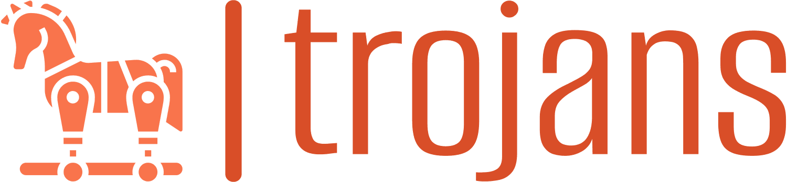

<a name="readme-top"></a>

<!-- PROJECT SHIELDS -->

[![Contributors][contributors-shield]][contributors-url]
[![Forks][forks-shield]][forks-url]
[![Stargazers][stars-shield]][stars-url]
[![Issues][issues-shield]][issues-url]

<!-- PROJECT LOGO -->
<br />
<div align="center">
  <a href="https://github.com/GiangHoGoVap/trojans">
    
  </a>

<h3 align="center" class="js-nav-logo">trojans</h3>
  <p align="center">
    A custom-built Genetic Algorithm-based solver for university course timetabling (ITC-2007 Track 3)
    <br />
    <a href="#about-the-project">Learn More</a>
    ·
    <a href="https://github.com/GiangHoGoVap/trojans/issues">Report Bug</a>
    ·
    <a href="https://github.com/GiangHoGoVap/trojans/pulls">Request Feature</a>
  </p>
</div>

---

## 📘 Table of Contents

-   [About The Project](#about-the-project)
    -   [Built With](#built-with)
-   [Getting Started](#getting-started)
    -   [Build & Run](#build--run)
-   [Usage](#usage)
-   [Contributing](#contributing)
-   [Contact](#contact)

---

## 📌 About The Project

**trojans** is a university course timetabling solver based on a **Genetic Algorithm** implemented entirely in **C++**.  
The project aims to solve the **ITC-2007 Track 3 problem**, optimizing hard and soft constraints like:

-   No student attends more than one lecture at the same time.
-   Room capacity should meet the student demand.
-   Curriculum compactness (lectures close in time).
-   Room stability (same room for a course).
-   Minimum working days for courses.

---

### 🛠️ Built With

-   [C++17](https://en.cppreference.com/w/cpp/17)
-   Custom genetic algorithm operators
-   CMake (optional, manual compilation supported)

---

## 🚀 Getting Started

To get a local copy up and running, follow these simple steps.

### 📦 Build & Run

1. Clone the repo:

```bash
git clone https://github.com/GiangHoGoVap/trojans.git
cd trojans
```

2. Compile:

```bash
g++ -std=c++17 -Iheader main.cpp -o ga_solver
```

3. Run with an ITC-2007 input file:

```bash
./ga_solver data/comp00.ctt
```

---

## 🧪 Usage

-   The project uses a modular design: `Faculty` for data handling, GA engine in `main.cpp`, and decoding logic to evaluate individuals.
-   Customize `decode_individual()` or the penalty functions to try new heuristics or penalty strategies.
-   Upcoming research: Experiment with adding **Kempe chains**, **local search**, or hybrid methods for improved performance.

For more technical discussion or help, feel free to [email me](mailto:minhtam27022001@gmail.com).

---

## 🤝 Contributing

Contributions are welcome! If you have suggestions, ideas, or improvements, please:

1. Fork the repository.
2. Create a feature branch: `git checkout -b feature/AmazingIdea`
3. Commit your changes: `git commit -m 'Add some AmazingIdea'`
4. Push to the branch: `git push origin feature/AmazingIdea`
5. Open a pull request.

Also feel free to open issues with bugs, questions, or feature requests.

---

## 📫 Contact

Tam Nguyen – <a href="mailto:minhtam27022001@gmail.com?"></a>

Project Link: [https://github.com/GiangHoGoVap/trojans](https://github.com/GiangHoGoVap/trojans)

<p align="right">(<a href="#top">back to top</a>)</p>

<!-- MARKDOWN LINKS & IMAGES -->

[contributors-shield]: https://img.shields.io/github/contributors/GiangHoGoVap/trojans.svg?style=for-the-badge
[contributors-url]: https://github.com/GiangHoGoVap/trojans/graphs/contributors
[forks-shield]: https://img.shields.io/github/forks/GiangHoGoVap/trojans.svg?style=for-the-badge
[forks-url]: https://github.com/GiangHoGoVap/trojans/network/members
[stars-shield]: https://img.shields.io/github/stars/GiangHoGoVap/trojans.svg?style=for-the-badge
[stars-url]: https://github.com/GiangHoGoVap/trojans/stargazers
[issues-shield]: https://img.shields.io/github/issues/GiangHoGoVap/trojans.svg?style=for-the-badge
[issues-url]: https://github.com/GiangHoGoVap/trojans/issues
